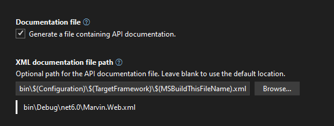

# Marvin Web

## Getting Started

1. Build `Ctrl+F5` 🏗
2. Migrate `update-database` 📅
3. Hit F5 🚀

To generate a migration script run Script-Migration

## Project Structure

The project follows a clean architecture design structure. You can see from the naming convention of the top level folders this gives us a nice easy structure to locate code quickly. `Areas - Code - Data - Domain`


### Areas

Areas hold the application and presentation models and views.

### Code

This is the infrastructure layer

### Data

This contains anything related to persistence

### Domain

The domain layer has its own folder self named. This contains the domain entities.

## Adding the user secrets

To use Google and Facebook login you need to ensure the secrets are added

### Facebook Secrets

```
dotnet user-secrets set "Authentication:Facebook:AppId" "appid"
dotnet user-secrets set "Authentication:Facebook:AppSecret" "secret"
```

### Google Secrets

```
dotnet user-secrets set "Authentication:Google:ClientId" "<client-id>"
dotnet user-secrets set "Authentication:Google:ClientSecret" "<client-secret>"
```

## Data

You can choose between *MSSQL* or *PostgreSQL* databases and both connection strings have entries in the `appsettings.json` file.   
You can switch between the two by setting the `ActiveConnectionString` value to the name of the connection string that you want to use.

Select `MssqlConnection` | `PostgresConnection` depending on which one you want to use.


## Postgres

> Tested with Postgres version for windows 14.5.1

You'll have to remove any existing migration you did for MSSQL and then you can do this in the package manager:

```powershell
Add-Migration InitialPersistedGrantDbMigration -c ApplicationDbContext -o Data/Migrations

update-database
```

Now run project and it will use postgres

## Health Checks

You can access the local health check endpoint on `/HealthChecks-UI`, this will be available over the internet for development.

There are three new endpoints for health check
* `/HealthChecks-Api`, this is used by the UI
* `/HealthChecks`, this is the Json output of the healthcheck and it collated by the API endpoint
* `/Status`, this is a simple Healthy, Degraded or Unhealthy status of the site

Within the application code there is now a HealthChecks folder with an Example Health check this is configured as below along with a PostgreSQL health Check

```
builder.Services.AddHealthChecks()
    .AddNpgSql(connectionString, name: "Database")
    .AddCheck<ExampleHealthCheck>("Example");
```

For more information on Health Check UI see the GitHub repository [https://github.com/Xabaril/AspNetCore.Diagnostics.HealthChecks](https://github.com/Xabaril/AspNetCore.Diagnostics.HealthChecks)

## Logging

Serilog is used as the logging and enriching framework, this is configured using the application settings and by default only logs to the Console

A helpful article on logging can be found on [https://benfoster.io/blog/serilog-best-practices/](https://benfoster.io/blog/serilog-best-practices/)

## Open API

The Swashbuckle UI can be found at `/Swagger/index.html` and the JSON data can be found at `/swagger/v0.9/swagger.json`

The `Swashbuckle.AspNetCore` package is used to deliver Open API specifications and the `Microsoft.AspNetCore.Mvc.Versioning.ApiExplorer` NuGet is used to generate the version information. 

Controllers can be decorated with various attributes to aid in the generation of Open API documentation:
* `ApiVersionAttribute` - is used on the Controller to denote the version of that controller.
* `ProducesAttribute` - is used on a method to define the data type, for example `"application/json"` for JSON formatted data.
* `ProducesResponseTypeAttribute` - is used on methods to denote the HTTP response codes supported as well as the object returned.

XML comments on the Controller Class, Controller Methods, Model Class and Model Properties are used to document what the classes are used for and their functions.  

This is enabled on the Properties page of the Project under the *Output* check the *Documentation file box* and enter the path `bin\$(Configuration)\$(TargetFramework)\$(MSBuildThisFileName).xml` for the auto generated xml document.



More information of documenting can be found in the following Microsoft articles
* https://learn.microsoft.com/en-gb/dotnet/csharp/language-reference/xmldoc/recommended-tags
* https://learn.microsoft.com/en-gb/dotnet/csharp/language-reference/compiler-options/output

## Hashids

The test API uses Hashids, a non cryptographic encoded string, that can be used to obfuscate database Ids. Examples of this can be found in YouTubes URIs [https://youtu.be/tSuwe7FowzE](https://youtu.be/tSuwe7FowzE) where `tSuwe7FowzE` is a Hashid

The URI above is also a video on Hashids that explains their use.  These are demonstrated in API V2 as a breaking change from 1 to 2.

## Testing with Selenium IDE

Get the Chrome Selenium IDE extension: [Selenium IDE](https://www.selenium.dev/selenium-ide/)

Once this is installed you can record and create some basic front end tests. These can be used as smoke tests for the local environment.

### Running the tests

1. Fireup the local development environment
2. Open the SeleniumIDE chrome extension
3. Choose "Open an existing project" from the IDE
4. Select the `Lifebuddy.side` test suite from `src\Marvin.Tests\SeleniumIDE`
5. Run the tests, and you should see all green 😇

## Validators

Validators are able to check for Null arguments and throw an ArgumentNullException, this should 
be neater than having if statements throughout the code.  The Validators can be strung together
to check for many exceptions cleaning up the code.

`Validation.Begin().ArgumentNullCheck(object1, name1).ArgumentNullCheck(object2, name2).Check()

This is based on the following blog https://blog.getpaint.net/2008/12/06/a-fluent-approach-to-c-parameter-validation/

## Useful Resources

A list of useful resources for the project

### Functional Programming

- [Going all in with Functional C#](https://edcharbeneau.com/csharp-functional-workshop-instructions/)
- [FuncSharp YouTube Video](https://www.youtube.com/watch?v=t20txMT82ws&t=200s)
- [F Sharp For Fun And Profit](https://fsharpforfunandprofit.com/site-contents/#functional-design)
- [Parse, don't validate](https://lexi-lambda.github.io/blog/2019/11/05/parse-don-t-validate/)
- [Primitive obsession](https://hackernoon.com/what-is-primitive-obsession-and-how-can-we-fix-it-wh2f33ki)
- [Ploeh Blog by Mark Seeman](https://blog.ploeh.dk/)
  - [Archive](https://blog.ploeh.dk/archive/)
- [Type classes explained](https://medium.com/@olxc/type-classes-explained-a9767f64ed2c)
- [Out of the tarpit](https://github.com/papers-we-love/papers-we-love/blob/master/design/out-of-the-tar-pit.pdf)
- [Functional Design Patterns](https://www.youtube.com/watch?v=srQt1NAHYC0)

### General Coding

- [Object Calisthenics](https://dev.to/pbouillon/writing-cleaner-code-with-object-calisthenics-1ea0)
