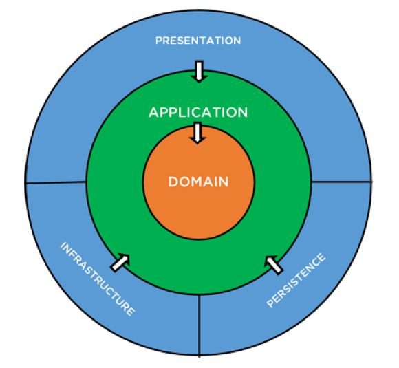

# Marvin Web

## Getting Started

1. Build `Ctrl+F5` 🏗
2. Migrate `update-database` 📅
3. Hit F5 🚀

To generate a migration script run Script-Migration

## Project Structure

The project follows a clean architecture design structure. You can see from the naming convention of the top level folders this gives us a nice easy structure to locate code quickly. `Areas - Code - Data - Domain`



### Areas

Areas hold the application and presentation models and views.

### Code

This is the infrastructure layer

### Data

This contains anything related to persistence

### Domain

The domain layer has its own folder self named. This contains the domain entities.


## Adding the user secretes

To use Google and Facebook login you need to ensure the secrets are added

### Facebook Secrets

```
dotnet user-secrets set "Authentication:Facebook:AppId" "appid"
dotnet user-secrets set "Authentication:Facebook:AppSecret" "secret"
```

### Google Secrets

```
dotnet user-secrets set "Authentication:Google:ClientId" "<client-id>"
dotnet user-secrets set "Authentication:Google:ClientSecret" "<client-secret>"
```

## Data

You can choose between *MSSQL* or *PostgreSQL* databases and both connection strings have entries in the `appsettings.json` file.   
You can switch between the two by setting the `ActiveConnectionString` value to the name of the connection string that you want to use.

Select `MssqlConnection` | `PostgresConnection` depending on which one you want to use.


## Postgres

> Tested with Postgres version for windows 14.5.1

You'll have to remove any existing migration you did for MSSQL and then you can do this in the package manager:

```powershell
Add-Migration InitialPersistedGrantDbMigration -c ApplicationDbContext -o Data/Migrations

update-database
```

Now run project and it will use postgres

## Health Checks

You can access the local health check endpoint on `https://localhost:7292/HealthChecks-UI`, this will be available over the internet for development.

There are three new endpoints for health check
* `https://localhost:7292/HealthChecks-Api`, this is used by the UI
* `https://localhost:7292/HealthChecks`, this is the Json output of the healthcheck and it collated by the API endpoint
* `https://localhost:7292/Status`, this is a simple Healthy, Degraded or Unhealthy status of the site

Within the application code there is now a HealthChecks folder with an Example Health check this is configured as below along with a PostgreSQL health Check

```
builder.Services.AddHealthChecks()
    .AddNpgSql(connectionString, name: "Database")
    .AddCheck<ExampleHealthCheck>("Example");
```

For more information on Health Check UI see the GitHub repository [https://github.com/Xabaril/AspNetCore.Diagnostics.HealthChecks](https://github.com/Xabaril/AspNetCore.Diagnostics.HealthChecks)