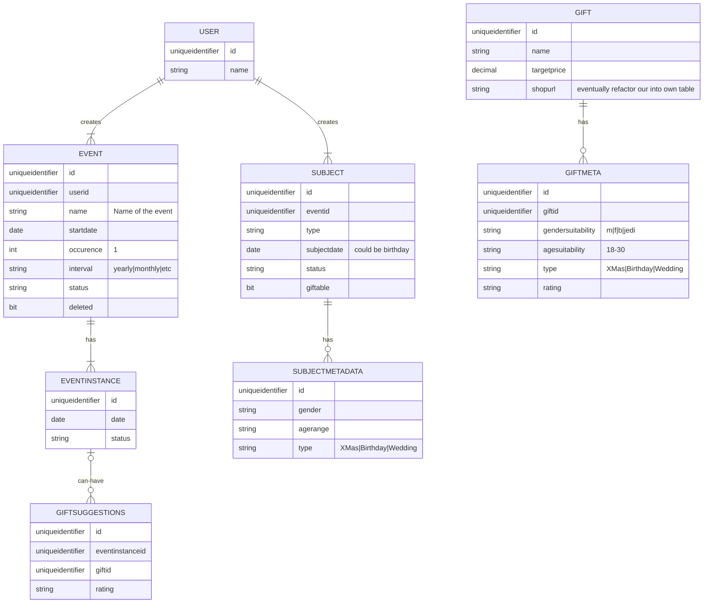

# Database Design

The main entity is the user and the person that logs it. Data flows from this user as they will have subjects to be reminded about and events to be monitored and aware of.

## Example

### Wedding Anniversary

**User:** Bob  
**Subject:** Wedding Anniversary  
**Event:** 5th November (occurence 1 per year) 
**EventInstance:** 5th November 2022

### Date Night

**User:** Bob  
**Subject:** Date night with the wife  
**Event:** 25th December (once every two months)  
**EventInstance:** 25th December 2022  
**EventInstance:** 25th February 2023  

### Queries

```sql
SELECT events for a user
SELECT due events (using instance table) ORDER BY instance date desc
SELECT gift suggestions for event instances
INSERT gift suggestions based of suggestions
```


